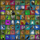

#  CYBER DOJO JAVASCRIPT

> My cyber dojo solutions

## KEY
* 🚧 - TODO ..
* 💚 - FUTURE ..
* 🔥 - DONE

## PROGRESS 🚀 [-/41]

|    Exercises       |    Status  |
| :-------------  | :------------- |
|  100 doors | 🚧 |
|  Anagrams | 🚧 |
|  Balanced Parentheses | 🚧 |
|  Bowling Game | 🚧 |
|  Calc Stats | 🚧 |
|  Combined Number | 🚧 |
| Count Coins | 🚧 |
| Diversion | 🚧 |
| Eight Queens | 🚧 |
| Fizz Buzz | 🚧 |
| Fizz Buzz Plus | 🚧 |
| Friday 13th | 🚧 |
| Game of Life | 🚧 |
| Gray Code | 🚧 |
| Haiku Review | 🚧 |
| Harry Potter | 🚧 |
| ISBN | 🚧 |
| LCD Digits | 🚧 |
| Leap Years | 🚧 |
| Mars Rover | 🚧 |
| Mine Field | 🚧 |
| Monty Hall | 🚧 |
| Number Chains | 🚧 |
| Number Names | 🚧 |
| Phone Numbers | 🚧 |
| Poker Hands | 🚧 |
| Prime Factors | 🚧 |
| Print Diamond | 🚧 |
| Recently Used List | 🚧 |
| Reordering | 🚧 |
| Reverse Roman | 🚧 |
| Reversi | 🚧 |
| Roman Numerals | 🚧 |
| Saddle Points | 🚧 |
| Tennis | 🚧 |
| Unsplice | 🚧 |
| Word Wrap | 🚧 |
| Yatzy | 🚧 |
| Yatzy Cutdown | 🚧 |
| Zeckendorf Number | 🚧 |
| set it up | 🚧 |

## REFERENCE
[cyber-dojo](http://cyber-dojo.org/)

## LICENSE
[MIT](./LICENSE)
