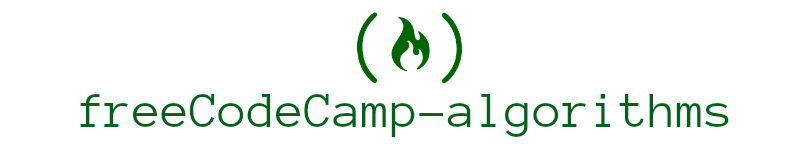

> 🤺 46 "Free Code Camp Algorithm Scripts"

---

  
 🔮 BASICS (<strong>16</strong>)

  

  * [Reverse a String](./lib/reverse.js)
  * [Factorialize a Number](./lib/factorialize.js)
  * [Check for Palindromes](./lib/palindromes.js)
  * [Find the Longest Word in a String](./lib/longest.js)
  * [Title Case a Sentence](./lib/title-case.js)
  * [Return Largest Numbers in Arrays](./lib/largest-num.js)
  * [Confirm the Ending](./lib/confirm-end.js)
  * [Repeat a string repeat a string](./lib/repeat-string.js)
  * [Truncate a string](./lib/truncate.js)
  * [Chunky Monkey](./lib/chunky-monkey.js)
  * [Slasher Flick](./lib/slasher.js)
  * [Mutations](./lib/mutations.js)
  * [Falsy Bouncer](./lib/bouncer.js)
  * [Seek and Destroy](./lib/destroyer.js)
  * [Where do I belong](./lib/getIndexToIns.js)
  * [Caesars Cipher](./lib/rot13.js)

  

---

  
 🔮 INTERMEDIATE (<strong>21</strong>)

  

* [Sum All Numbers in a Range](./lib/sumAll.js)
* [Diff Two Arrays](./lib/diffArray.js)
* [Roman Numeral Converter](./lib/convertToRoman.js)
* [Wherefore art thou](./lib/whatIsInAName.js)  
* [Search and Replace](./lib/myReplace.js)
* [Pig Latin](./lib/translatePigLatin.js)
* [DNA Pairing](./lib/pairElement.js)
* [Missing letters](./lib/fearNotLetter.js)
* [Boo who](./lib/booWho.js)
* [Sorted Union](./lib/uniteUnique.js)
* [Convert HTML Entities](./lib/convertHTML.js)
* [Spinal Tap Case](./lib/spinalCase.js)
* [Sum All Odd Fibonacci Numbers](./lib/sumFibs.js)
* [Sum All Primes](./lib/sumPrimes.js)
* [Smallest Common Multiple](./lib/smallestCommons.js)
* [Finders Keepers](./lib/findElement.js)
* [Drop it](./lib/dropElements.js)
* [Steamroller](./lib/steamrollArray.js)
* [Binary Agents](./lib/binaryAgent.js)
* [Everything Be True](./lib/truthCheck.js)
* [Arguments Optional](./lib/addTogether.js)

---

  
 🔮 ADVANCED (<strong>9</strong>)

  

* [Validate US Telephone Numbers](./lib/telephoneCheck.js)
* [Record Collection](./lib/updateRecords.js)
* [Symmetric Difference](./lib/sym.js)
* [Exact Change](./lib/checkCashRegister.js)
* [Inventory Update](./lib/updateInventory.js)
* [No repeats please](./lib/permAlone.js)
* [Make a Person](./lib/makePerson.js)
* [Map the Debris](./lib/orbitalPeriod.js)
* [Pairwise](./lib/pairwise.js)

## Reference
[Free Code Camp](https://www.freecodecamp.com/)

## License
[MIT](./license) © [Raghib Hasan](http://raghibm.com/)
