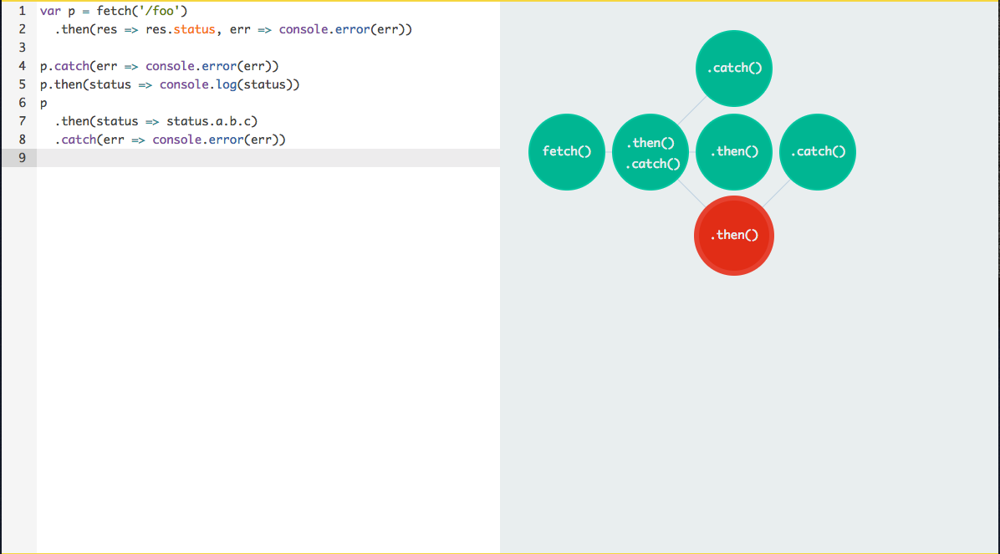

# What is a promise ? 🤔

*   A promise represents the eventual result of an asynchronous operation. - [Promise/A+](https://promisesaplus.com/)

*   A Promise is a proxy for a value not necessarily known when the promise is created. It allows you to associate handlers with an asynchronous action's eventual success value or failure reason. This lets asynchronous methods return values like synchronous methods: instead of immediately returning the final value, the asynchronous method returns a promise to supply the value at some point in the future. - [Promise/MDN](https://developer.mozilla.org/en-US/docs/Web/JavaScript/Reference/Global_Objects/Promise)

