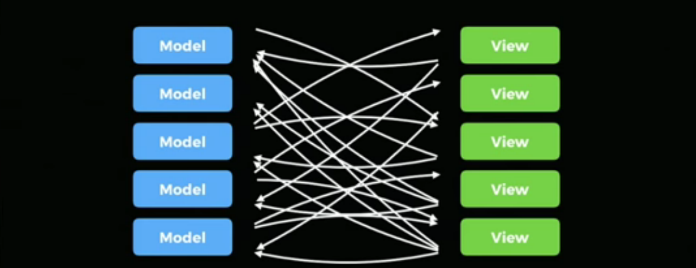

# Immutable User Interface

## Abstract

- Making apps both Mobile and Web application
- Problems that make them hard
- Patterns and solution that helps it make faster and more robust application
- Usage of Less Complex code and easier to understand
- Not specific to any library,framework or platform either
- Architecture not Libraries
- The same principle applies both to iOs apps as well as JavaScript apps
- Ideas can be implemented in various ways

## What is Architecture ?

- Shared understanding what we mean by the word `Architecture`
- In terms of **Software**, Architecture is a `Metaphor`
- Borrowing the idea of building actual buildings, clear parallels(ideas) we can draw between these ideas
- Architecture originates from studying one of the most important technological advances of building things, which is the `Arch`
  
- `Arch`, is a very simple shape that is infinitely composable, which allows us to build more larger and complex buildings ever before
  
- `Marcus Vitruvius Pollio`, Roman Scholar and an Architect. Written principles for satisfying good architecture
- `FIRMISTAS` - means `Durability`, a building should stand up robustly and remain in good condition. (Should be robust and have longevity). When we build apps, we look for the architecture choices that help us reduce bugs and improve performance
- `VTILITAS` - means `Utility`, it should be suitable for the purposes for which it is used(Should be relevant on how its being used, materials, technologies and the aesthetics that is acheived on building a home will be different from building an office building, place of worship or auditorium. Each places are used in a different way).Architecture choices we make for our application can differ widely,it depends on the complication of the app, how it's going to be used, is it static or dynamic? , Simple or complex, relying on network or live data (realtime ???)
- `VENVSTAS` - means `Beauty`, it should be aesthetically pleasing.(Building should be both desirable and usable. Propotion, repitation and scale). Parallel here is not specified to User experience but more towards Developer experience. Architectual choices does impact, how hard or easy the team or us to improve our apps. Also Iterate on the choices over time
- Architecture is more about `Fundamental Structural Choices` on how we are going to build things, with the qualities that Vitruvis set for us 2000 years ago
- In Software Architecture we make the same fundamental strucutural choices based on the understanding on what our apps need to do and the challenges it's going to face
- Architecutre is about Choosing Elements of Abstraction, to create variation and robustness. To support the role of the app, solve it's primary challenges and create a productive space for ourself and other devs/engineers

## MVC & REST

- Information Rich User facing application, like the web and mobile apps that are being built. There is a really dominant architecture over the last decade or more, which is `MVC` and `REST`
- For the Rich User facing apps, there is one biggest challenges that needs to be solved

## 💪 Challenge1: (What Changed ?)

- How can I tell when something has changed so that my `models`, my `views` and my `servers` stay up to date with each other?
- `MVC` has left us with a poor solution to this problem
- It attempts to solve this by adding even more things that can change
- `Models` sending change events
- `Views` getting out of sync
- Race conditions when doing multiple things interacting with the server
- When `Models` and `Views` both need to listen to each other for changes


it is easy what it would be a small change.


But this small change seems to have cascading effects, that creates unpredictable effects on the entire application

## 💪 Challenge2: (Data Synchronization)

- Syncronizing data with our servers
- Modern mobile networks are still not the best
  - `Latency`- Can be measured in large parts of a second. Minimising requests to servers is critical for performance.
  - `Intermittency`- Supporting Offline mode, we know that noone goes offline. The meaning of supporting offline is when you go `underground on the Metro` or `Driving between cell towers`. When we mention Offline mode, we mean `Intermittency mode`.
  - `Failure` - Handing such network failures is very criticial
- Rest helped us model our data in terms of network service, it seems to have a bad effect on the performance when an app needs lots of data when it is dependent on loading lots of other data.
  - Example: `Building a Social Calendar App`
    - Get my friends
    - What are their names and avatar pictures?
    - What are the next events they're attending?
    - What are the names and details of those events?
    - We'll be needing to load a lot of stuffs from a `Rest-end point`
      - `/friends`
      - `/user/1`
      - `/user/2`
      - `/user/1/events`
      - `/event/1`
      - `/event/2`
      - `/user/2/events`
      - `/event/3`
      - `/event/4`
  - `REST API`, typically returns `URLs`, where one resource references another resource, they end up loading a lot of resources, that are dependent on others.
  - This means, we need to wait for previous `URLs`, to load before we can start loading the other ones
  - That means other stuffs we are getting like `HTTP/2` `pipe lining`,it is unable to solve this sort of problem
  - When network latency is measured in big chunks of a second,this stuff adds up really fast
  - This applies to even moderately complicated apps, `3-5 seconds` slowdowns just on the **latency** , excluding the other things that happen on the network
  - Dealing with such problem, handling both a `flakey network` and a `slow network` puts us in a difficult sticky situation
  - We might show a `loading indicator`, if someone performs an action in their apps, but networks can be slow. The User doesn't need to sit and stare at the loading indicator. We might wanna guess what the server is going to do and show that to them right away
  - But in terms of `flakey-network`, What if it doesn't `work`?
    - Should we `roll-back`?
    - What happens, if `multiple actions` are done at the same time?
    - Figuring out which order to do such things?
    - Such above things mentioned creates a chaos
  - It's not only challenging but also unfortunately a very common scenario that needs to be solved in our app
  - A really powerful technique, that we have to get a better control on such problems.That's by tightly controlling what can change in the first place by embracing `Immutabilty`

## Immutability

- It's simpler
- Less complicated to what we were doing previously
- Removing a feature, the **ability** to `mutate data`
- When the feature is given up, we are also giving up some `power` and the abilities it comes with that power but in exchange for that, we get **new** `principles`
- With `principles`, we have new `gurantees` about what `can` and `can't` happen in our programs.
- We can leverage those `principles`, `guarantees`. To do performance optimisations and other whole-program optimisations to get a better app speed overall
- This is the **crux**(the decisive or most important point at issue) as Software engineers
- It's about `balancing` between `power` and `principles` to get the `power` that we need to build the apps that we need to do and also get the principles we need in order to build great/best things
- If we cared about software having the most power possible, then we would have stopped at `assembly` or `go-to`

```assembly
goto $-10
```

- All programming languages are **Turing** complete, similar power is everywhere
- `go-tos` are increadibly powerful, alot can be achieved with it
- Instead, we are looking for more principled ways to apply the power we already have
- Most modern languages, have **foregone** `go-to` in favour of a `for-loop`

```javascript
for element in list
```

- Not everything can be done with `for-loop`, that could be done with `go-to`
- `Principles` and `constraints` that it provides, `gurantees` some things that can and can't happen in the app
- Many of the more modern languages, even **forgo** `for-loop`, in favour of `map`, `filter`, `reduce` and other `higher order functions` on things that can be `looped` over

```javascript
list.reduce(reducer)
```

- `Leverage Principled Power`- It's really not about the power of the software but it's more about the principles that you can leverage
- Immutable data, brings principles and gurantees, on what can change and when so that we can use techniques that previously we couldn't rely upon such as `memoization` and `Time travel`
- Moving on from `MVC` & `REST` and rethinking the core architecture on how to build stuffs that we build all the time

## Immutable App Architecture

- Observation made of what is being built on `Facebook` and seeing built by broader development community. A new kind of app architecture emerge to better solve this problems
- Heavily inspired by similar architectures, that can be seen in `functional reactive programming environments`, that is the result of many years of research
- Heavily inspired by the programming language `Elm`

## Immutable User Interface

- Immutable UI doesn't mean our screen is frozen, you can't do anything with it.
- It instead means, that we are going to embrace the principle of immutablity in each point of the architecture of our application
- `Tigthly control change` - It means we are going to be able to control exactly where changes occured and we are going to leverage that in order to apply some techniques such as `memoization` and `time-travel` to build faster and more robust apps.
- Lets start with first principles, `Views`

  

### Views

- Every platform that we care about building apps for, already has the concept of the `view`.
- The **Web** has `DOM elements`
- `iOS` apps has `UI-Views`
- `Android` apps has `Android.View`
- All of them have a similar API that helps you build this view tree

  

- We use this because they expose the native user interface on each platform, but these `API's` are not great

  - **Creating** elements

  ```javascript
  let e = createElement()
  ```

  

  - Altering **properties** of the elements

  ```javascript
  e.color = Colors.RED
  ```

  

  - Adding **them(changes)** to parent elements

  ```javascript
  other.addChild(e)
  ```

  

  - All the above are mutative operations
  - After performing such mutativae operations, you need to track the `references`
  - `References` for looking up `ids`, keeping references as members in classes.
  - It's tough doing this, as we need to keep to track of alot of stuffs
  - What we really want is `abstraction` on top of views

    

    - Let's us declare what view should be displayed at any point in time
    - We refer to them as **components**,
      `(State) => View`
    - A component, defines a `pure function`, the state of things, the state of the world goes in and what you want to see on the screen comes out.
    - A good component library should do for you is provide, pure `functional developer API`,but under the hood, do all the hard work of managing the mutable view API exposed by all platforms, it needs to do that in a way that leverages all the performance techniques we can get when we apply this limited power in favour of the principle of having this one function to define things
      ```javascript
      // Example
      <MyView someData={myData} />
      ```

  - When we render `<MyView>` component, we get back **virtual views**

    

  - Virtual views are representation of what we want to see, they have the same structures, elements, propertie, children, but they're just in-memory objects, not on screen yet

    

  - First-time we **re-render** these components and get these **views**. The component library can take the virtual views and create the underlying native views on whatever platform.

  
