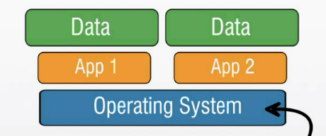
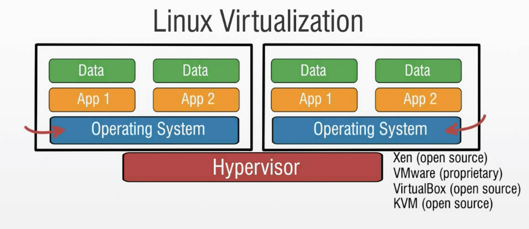

# Linux Implementations 🔨

*   Linux as Desktop

*   Linux as a Server
    *   File server
    *   Print server
    *   Database server (MySQL, MariaDB, PostgreSQL, NoSQL)
    *   Web server (Apache, ...)
    *   E-mail server
    *   Super computing

*   Mobile Linux
    *   Android

*   Linux Virtualization

*   Linux and Cloud Computing

    *   Infrastructure as a Service(IaaS)
    *   Software as a Service(SaaS)
    *   Network as a Service(NaaS)
    *   Storage as a Service(STaaS)
    *   Desktop as a Service(DaaS)
    *   Platform as a Service(PaaS)

*   Embedded Linux
    *   Industrial automation and control equipment
    *   Network devices
    *   Video game systems
    *   Smart entertainment devices
    *   Smartphones and tablets
